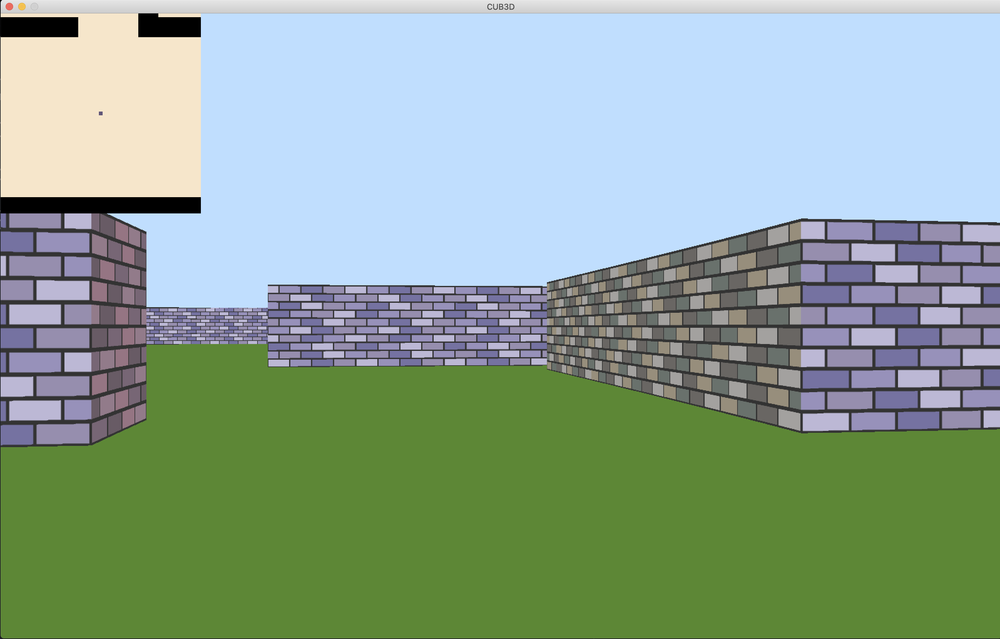

# cub3D

## Overview



**cub3D** is a 3D graphics project inspired by the classic game Wolfenstein 3D. It involves creating a first-person maze exploration game using the **MiniLibX** library. The project focuses on **raycasting**, a technique used to render 3D graphics by simulating how light rays interact with objects in a 2D map.

## Features

### Mandatory Part

- Raycasting-based 3D rendering of a maze.
- Smooth window management with **MiniLibX**.
- Floor and ceiling colors are defined in the configuration file.
- Wall textures vary based on direction (North, South, East, West).
- Keyboard controls:
  - **W, A, S, D**: Move the player.
  - **Left/Right Arrows**: Rotate the view.
  - **ESC**: Exit the game.
  - **Red Cross**: Close the game window.
- Parses a `.cub` file for map and settings.

### Bonus Features

- Wall collision detection.
- Minimap system.
- Mouse-controlled view rotation.

## Requirements

- **Language**: C
- **Graphics Library**: MiniLibX
- **Compilation Flags**: `-Wall -Wextra -Werror`

## Installation

1. Clone the repository:
   ```bash
   git clone https://github.com/rafiq-03/Cub3D.git
   cd cub3D
   ```
2. Build the project using the Makefile:
   ```bash
   make
   ```

## Usage

Run the program with a valid `.cub` file:

```bash
./cub3D path/to/your_map.cub
```

### Example `.cub` File

```
NO ./textures/north_texture.png
SO ./textures/south_texture.png
WE ./textures/west_texture.png
EA ./textures/east_texture.png
F 220,100,0
C 225,30,0

111111
100001
1000N1
111111
```

## Controls

- **W, A, S, D**: Move forward, left, backward, right.
- **Left/Right Arrows**: Rotate view.
- **ESC**: Quit the game.

## Conclusion

The **cub3D** project offers a fantastic opportunity to delve into 3D graphics programming and learn the fundamentals of raycasting. Completing this project will enhance your problem-solving skills and give you practical experience in creating graphical applications. Whether working on the mandatory part or exploring bonus features, cub3D provides a rewarding challenge that bridges mathematics and visual design.

